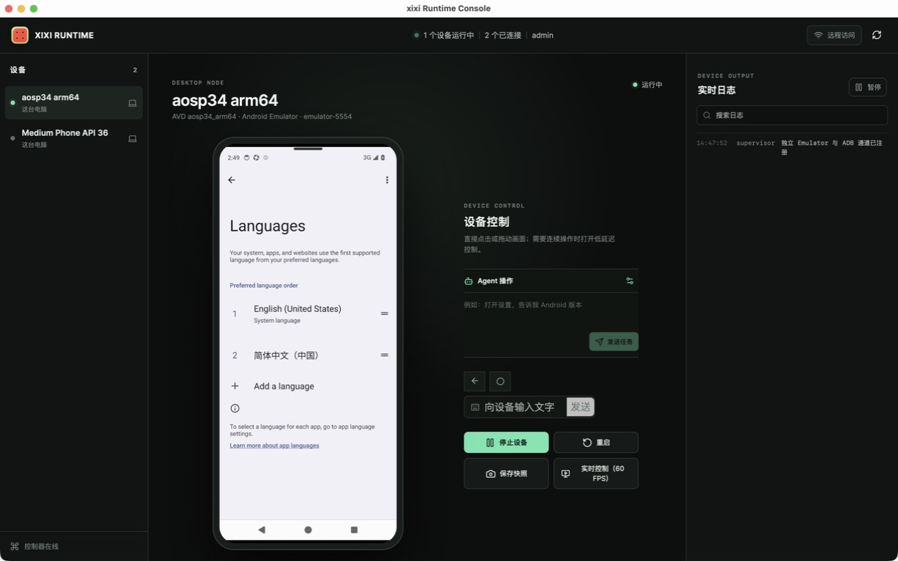
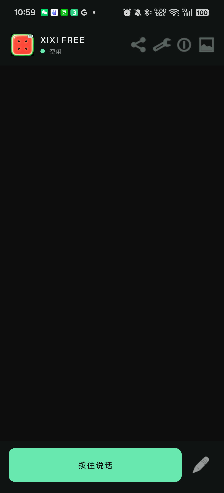
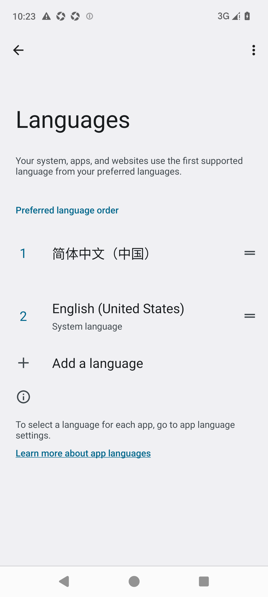
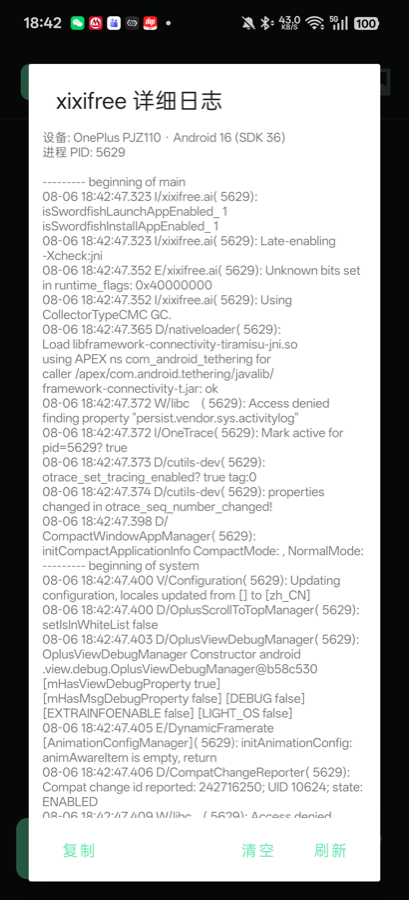

# xixi.ai 免费版

xixi.ai 可以通过文字指令协助操作 Android 应用。本仓库仅提供安装包、产品截图和安装所需脚本，不包含源代码。



## 下载

| 产品 | 下载 |
|---|---|
| xixiFree Android 版 | [下载 APK](releases/v0.3.2/xixifree-ai.apk) |
| xixi Desktop macOS 版 | [下载 DMG](releases/v0.3.2/xixi-Desktop-Node-macOS.dmg) |

文件校验信息见 [SHA256SUMS.txt](releases/v0.3.2/SHA256SUMS.txt)。

## 安装手机端

系统要求：Android 11 或更高版本。

1. 下载并安装 `xixifree-ai.apk`。
2. 启动 xixiFree，在设置中选择模型并填写 API Key。
3. 按应用提示开启无障碍和屏幕捕获权限。
4. 返回聊天页面，输入希望执行的任务。

如果手机阻止安装，请在系统设置中临时允许当前文件管理器或浏览器“安装未知应用”。

## 安装 macOS Desktop

### 第一步：准备运行环境

打开“终端”，进入本仓库目录后运行：

```bash
bash scripts/setup-desktop-macos.sh
```

安装过程需要联网，并可能要求输入 macOS 登录密码。完成后会自动准备默认的 Android 虚拟设备。

### 第二步：安装 Desktop

1. 打开 `xixi-Desktop-Node-macOS.dmg`。
2. 将 xixi Desktop Node 拖入“应用程序”。
3. 首次打开若被 macOS 阻止，请进入“系统设置 → 隐私与安全性”，选择仍要打开。
4. 在 Desktop 中选择默认设备并点击启动。

## 连接手机和 Desktop

1. 在 Desktop 中启动虚拟设备并开启远程访问。
2. 确保手机和电脑连接同一个 Wi-Fi。
3. 在 xixiFree 中打开“设置 → 远端设备”。
4. 填写 Desktop 页面显示的地址和配对信息。
5. 连接成功后，可从聊天页面进入远程控制。

## 产品截图

<p align="center">
  
  
  
</p>

## 常见问题

- Desktop 找不到虚拟设备：重新运行环境安装脚本，然后重启 Desktop。
- 手机无法连接 Desktop：确认两台设备在同一 Wi-Fi，并检查 macOS 是否允许 Desktop 接收网络连接。
- 手机端无法执行操作：检查无障碍和屏幕捕获权限是否仍然开启。
- 安装包下载损坏：使用 `SHA256SUMS.txt` 核对文件。

## 使用提醒

登录、验证码、支付和其他敏感操作请由用户本人完成。请仅在自己拥有或已获授权的设备、账号和应用上使用本软件。
